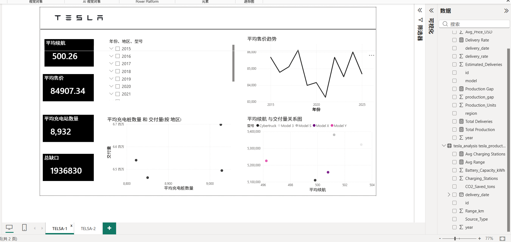
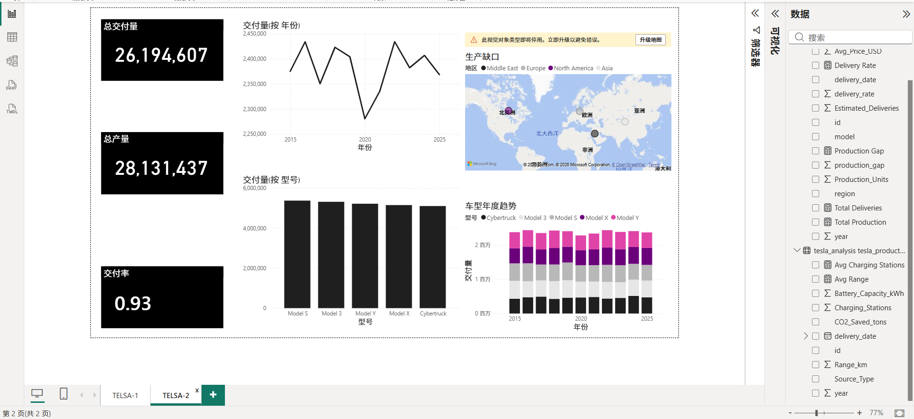

# Tesla Delivery Analysis

## 项目简介
本项目基于 Tesla 2015–2025 年交付数据与产品属性数据，使用 MySQL、SQL 和 Power BI 对交付表现、车型结构、地区分布、价格趋势及生产缺口进行分析，并搭建可视化看板。

## 使用工具
- MySQL
- SQL
- Power BI
- Excel

## 分析内容
- 年度交付趋势分析
- 各车型累计交付量分析
- 各地区交付表现分析
- 平均售价趋势分析
- 生产缺口与交付率分析
- 产品属性（续航、充电站数量）与交付关系分析

## 项目文件
- `tesla_analysis.sql`：SQL 数据清洗与分析脚本
- `特斯拉tesla 交付分析看板.pbix`：Power BI 看板源文件
- `特斯拉交付分析报告.pdf`：项目分析报告
- `dashboard_page1.png`：看板第一页截图
- `dashboard_page2.png`：看板第二页截图

## Dashboard 展示

## 核心结论
- Tesla 在样本期内保持了较高水平的交付规模，年度交付量整体波动有限。
- 各车型均对交付规模形成贡献，车型结构较为均衡。
- 各地区交付量差异不算极端，但地区交付效率与生产缺口存在差异。
- 平均售价整体较为平稳，产品属性与交付表现存在一定关联，但不是单一决定因素。
- 生产与交付之间存在一定缺口，说明仍有优化产销协同的空间。
